# Architecture

The `receiver` service is designed to be used as a publisher, which means it requires a set of consumers to work as intended. The workflow goes as follows:

1) a ``consumer`` notifies the `receiver` with a so called `ConsumerManifest`, which basically contains a list of sources the consumer is interested in.
2) the `receiver` registers the consumer, and (if necessary) also sets up a subscription to an altinn app
3) the `receiver` will from now on be ready to receive messages / documents from these sources and:

- process these messages (virus scan / document storage / persistence of structured data)
- notify all consumers if a new message is available

1) each `consumer` is (technically) responsible on its own to read / consume messages from valkey. But the `Arbeidstilsynet.Receiver` nuget package will provide convenience methods and extensions to fix this.

The following diagram illustrates with which kind of external services the **receiver** app communicates:

## Event driven `Melding` distribution

