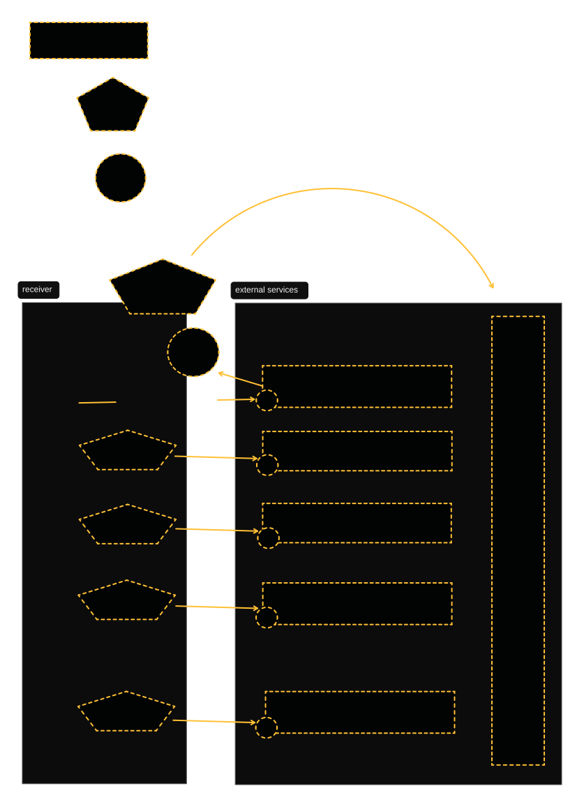
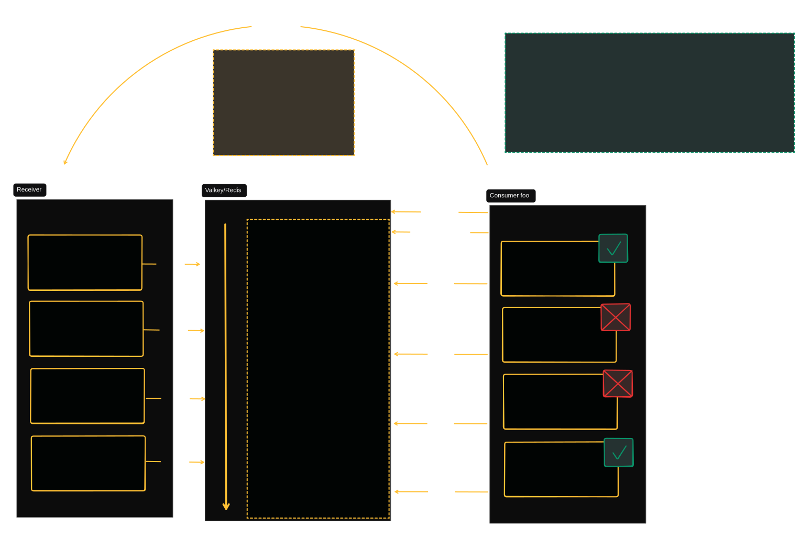

# Architecture

The `receiver` service is designed to be used as a publisher, which means it requires a set of consumers to work as intended. The workflow goes as follows:

1) a `consumer` notifies the `receiver` with a so called `ConsumerManifest`, which basically contains a list of sources the consumer is interested in.
2) the `receiver` registers the consumer, and (if necessary) also sets up a subscription to an altinn app
3) the `receiver` will from now on be ready to receive messages / documents from these sources and:

- process these messages (virus scan / document storage / persistence of structured data)
- notify all consumers if a new message is available

4) each `consumer` is (technically) responsible on its own to read / consume messages from valkey. But the `Arbeidstilsynet.Receiver` nuget package will provide convenience methods and extensions to fix this.

The following diagram illustrates with which kind of external services the **receiver** app communicates:

## Event driven `Melding` distribution

## Altinn attachment filenames

Newly received Altinn attachments use
`{sanitizedDataType}_{dataElementId}{extension}` rather than the original filename.
DataType retains only ASCII letters, digits, hyphens, and underscores; other characters
become underscores, with leading/trailing underscores removed. An empty result uses
`document`. If an attachment has no Altinn data element ID, Receiver generates a document ID and uses
the same ID in the filename.

Extensions come exclusively from a fixed Content-Type allowlist covering PDF, JSON,
XML, plain text, CSV, JPEG, PNG, GIF, TIFF, Microsoft Office, OpenDocument, and ZIP.
Matching ignores case and media-type parameters. Unknown types, including
`application/octet-stream`, have no extension; the original filename is never consulted.
Content-Type is retained unchanged. This naming policy does not validate the file's
actual format or replace virus scanning. PDF main content and structured data retain
their existing stable filenames. Existing stored documents are not renamed, and direct
(non-Altinn) uploads retain their existing naming behavior.
